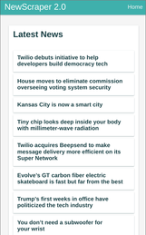

# NewScraper 2.0

Progressive web app for reading fresh news offline in the **subway** from various news sources. Open [NewScraper 2.0](https://newscraper.surge.sh) on your phone and add it to your homescreen to see the magic!

## Tech Stack

- [Webtask](https://webtask.io)
- [Preact-JS Starter](https://github.com/lukeed/preact-starter) - For this awesome offline ready boilerplate. [Preact](https://preactjs.com/) Isn't that different from React, it only weighs 3KB!
- [The News Api](http://newsapi.org) - Awesome news aggregation api. I'll definitely expand this app to take full advantage of the many sources here.
- [Mercury Api](https://mercury.postlight.com/web-parser/) - Amazing time saver, it goes and builds a _readable_ version of whatever article you supply it. _Think pocket/instapaper._

## Running/Deploying

#### Installation

  - `git clone` to clone this repo.
  - `npm install` (or `yarn` if you're hip like me).

#### Running Locally

  - Make sure you have the `MERCURY_KEY` and `NEWS_API` keys in the file called `secrets.json`.
  - If you're working on the worker, save your firebase-admin sevice account as `sa.json`.
  - `npm run watch`

#### Deploying

  - Run `npm run build`, this will spit out the production front-end in `dist` for you to serve on static hosting.

## To-Do

- More news sources. √
- Loading bar because I'm masochistic? _(I heard they were super hard.)_
- Transitions between views.
- Refine service worker, to make it more reliable. √
- Style for iOS devices (Ew! But needed for dumb iPhone X).
